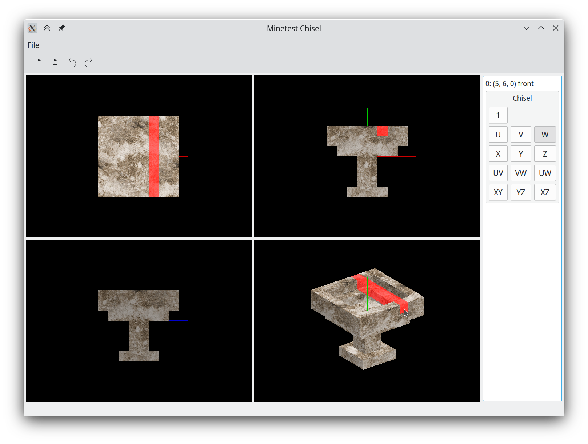

# Minetest Chisel
A tool for voxel modelling.

Dependencies (pip): PySide2, PyOpenGL, Numpy. (Yes I know these are heavy).

A file named `marble.png` is also required currently, it will be used as the (only) texture.

Originally intended for use with [Minetest](http://minetest.net). Coordinate system and lighting match those of Minetest.

Only basic interaction is implemented currently:

 * Removing single voxels, lines and planes (choose a tool from the toolbox at the right; UVW axes are relative to the selected face while XYZ axes are absolute)
 * Rotating the right-bottom viewport (with the middle mouse button)
 * Undo/redo

Loading/saving is not implemented yet, sorry.
